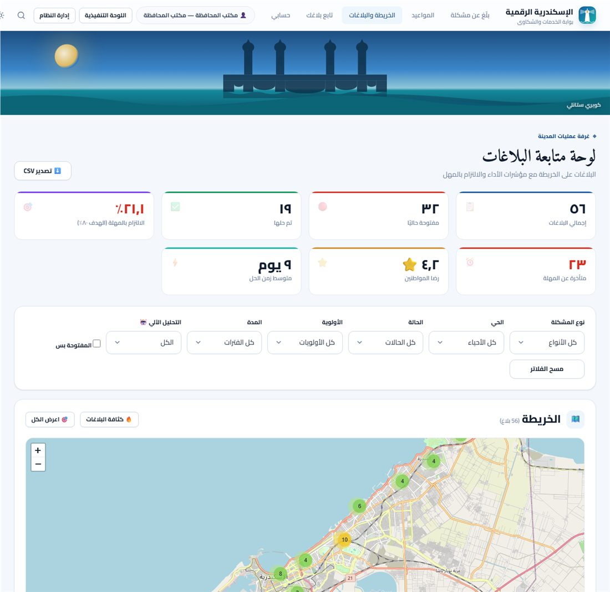
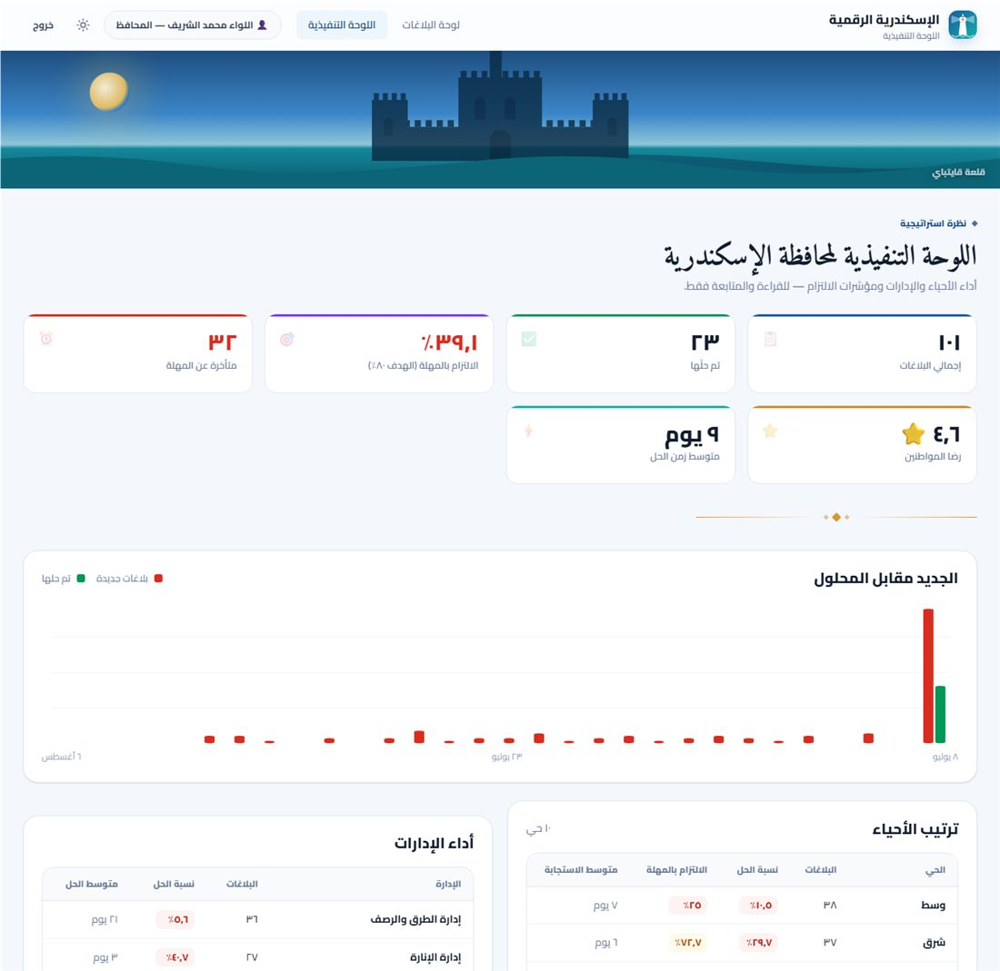
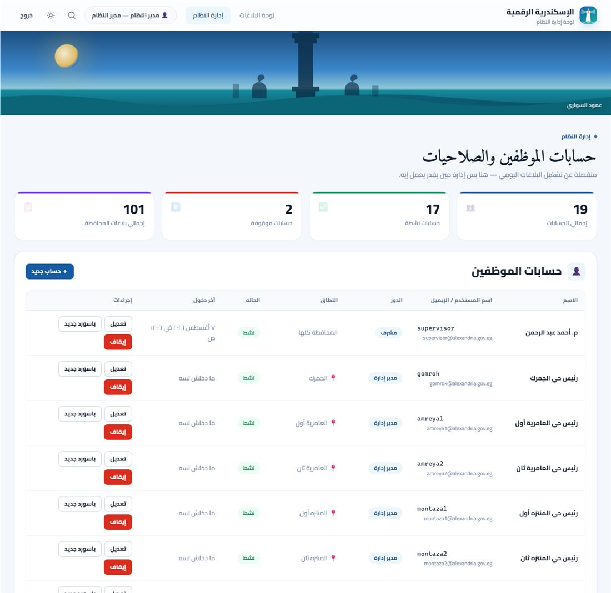

# 🏛️ منصة الإسكندرية الرقمية — الخدمات والشكاوى


منصة متكاملة لإدارة بلاغات وشكاوى المواطنين وخدمات المرافق العامة في محافظة الإسكندرية.
المواطن بيبلّغ بصورة وموقع، والنظام بيصنّف البلاغ آليًا، بيحوّله للإدارة المختصة،
بيراقب مهلة الحل، وبيصعّده تلقائيًا لو اتأخر — وكل ده في تسلسل وظيفي حقيقي من رئيس
الحي لحد المحافظ، بعزل صلاحيات مفروض على مستوى السيرفر مش مجرد إخفاء في الواجهة.

📄 **[وثيقة التصميم الشاملة](docs/وثيقة-التصميم-الشاملة.md)** — ٢٤ قسم للتقديم الرسمي
📘 **[دليل الواجهة والحسابات](docs/دليل-الواجهة-والحسابات.md)** — كل صفحة وكل حساب تجريبي

---

## لقطات من المنصة

| بلّغ عن مشكلة | لوحة متابعة البلاغات |
|---|---|
|  |  |

| اللوحة التنفيذية للمحافظ | إدارة النظام والحسابات |
|---|---|
|  |  |

---

## المحتويات

- [التشغيل](#التشغيل)
- [عزل الأحياء](#-عزل-الأحياء)
- [إيه اللي بتعمله](#إيه-اللي-بتعمله)
- [دورة حياة البلاغ](#دورة-حياة-البلاغ)
- [الأدوار والصلاحيات](#الأدوار-والصلاحيات)
- [البنية](#البنية)
- [ترحيلات المخطط](#ترحيلات-المخطط)
- [الـ API](#الـ-api)
- [الأمان](#الأمان)
- [تشغيل في الإنتاج](#تشغيل-في-الإنتاج)
- [الترقية من النسخة القديمة](#الترقية-من-النسخة-القديمة)
- [الرخصة](#الرخصة)

---

## التشغيل

محتاج **Node.js نسخة 22.5 أو أحدث** (بيستخدم `node:sqlite` المدمج — مفيش أي مكتبات native).

```bash
npm install
npm run set-password      # يعمل ملف .env ويظبط أول حساب موظف
npm run seed              # بيانات تجريبية + حسابات كل الأدوار (اختياري بس مفيد أول مرة)
npm start                 # http://localhost:3000
```

**للتطوير** (`npm run dev`) بيعيد تشغيل السيرفر تلقائيًا مع أي تعديل (`node --watch`).
لتشغيل الـ **٤٥٩ اختبار** (راجع [tests/run-all.mjs](tests/run-all.mjs)):
```bash
npm test
```

| الصفحة | الرابط | لمين |
|---|---|---|
| بلّغ عن مشكلة | `/` | الكل |
| احجز موعد | `/appointments` | المواطن |
| حسابي (طلباتي ومواعيدي) | `/my` | المواطن |
| دخول المواطنين (رقم قومي) | `/citizen-login` | المواطن |
| متابعة بلاغ بالرقم المرجعي | `/track` | الكل |
| الخريطة والبلاغات | `/dashboard` | **موظفي المحافظة فقط** |
| طابور المواعيد اليومي | `/queue` | موظفي مقار الحي |
| اللوحة التنفيذية | `/governor` | المحافظ ومكتب المحافظة — قراءة فقط |
| إدارة النظام والحسابات | `/admin` | الأدمن حصرًا |
| دخول الموظفين | `/login` | الموظفون — بيوجّه كل دور للوحته تلقائيًا |
| اعتمادات الصور | `/credits` | الكل |
| فحص الصحة | `/healthz` | المراقبة |
| مقاييس Prometheus | `/metrics` | المراقبة |

> المواطن والزائر **مايشوفوش خريطة البلاغات ولا تفاصيلها** — العزل مفروض على
> مستوى الـ API (`401` من غير جلسة موظف)، مش مجرد إخفاء في الواجهة.

### حسابات المواطنين التجريبية
الدخول بالرقم القومي + كود OTP. في التطوير الكود بيظهر على الشاشة (مفيش حاجة لمزوّد SMS):

| الرقم القومي | الاسم | الموبايل | الحي |
|---|---|---|---|
| `28501010200015` | محمود عبد العزيز | 01011223344 | شرق |
| `29203150201234` | فاطمة السيد | 01122334455 | وسط |
| `29807220200567` | أحمد رمضان | 01233445566 | المنتزه أول |
| `30011050201890` | نورهان مصطفى | 01044556677 | الجمرك |

### حسابات الـ seed التجريبية
**الباسورد للكل: `alexandria2026`** — الدخول بالإيميل أو اسم المستخدم، الاتنين شغّالين.

> ⚠️ حسابات تجريبية للعرض بس. غيّرها بـ `npm run set-password` أو من لوحة
> `/admin` قبل أي نشر حقيقي — الباسورد ده مكتوب في الكود ومعروف لأي حد شاف الريبو.

| المستخدم | الدور | اللوحة | الصلاحيات |
|---|---|---|---|
| `governor` | **المحافظ** | `/governor` | قراءة استراتيجية فقط — ممنوع من أي تعديل حتى لو دوره أعلى رقميًا |
| `governorate` | **مكتب المحافظة** | `/dashboard` | تشغيلي كامل عبر كل الأحياء |
| `admin` | مدير النظام | `/admin` | إدارة الحسابات — حصرًا هو، حتى المحافظ ممنوع |
| `supervisor` | مشرف | `/dashboard` | تحويل · رفض · حذف · سجل التدقيق |
| `agent` | موظف استقبال | `/dashboard` | تغيير الحالة · تعليقات · بيانات المُبلِّغ |
| `cleaning` | مدير إدارة النظافة | `/dashboard` | زي المشرف داخل إدارته |
| `lighting` | مدير إدارة الإنارة | `/dashboard` | زي المشرف داخل إدارته |

**حسابات رؤساء الأحياء — كل واحد يشوف بلاغات حيّه بس على `/dashboard` و`/queue`:**

| المستخدم | الحي | | المستخدم | الحي |
|---|---|---|---|---|
| `montaza1` | المنتزه أول | | `gomrok` | الجمرك |
| `montaza2` | المنتزه ثان | | `amreya1` | العامرية أول |
| `sharq` | شرق | | `amreya2` | العامرية ثان |
| `wasat` | وسط | | `borg` | برج العرب |
| `gharb` | غرب | | `borgnew` | برج العرب الجديدة |

التفاصيل الكاملة (ليه المحافظ ممنوع من التنفيذ، إزاي لوحة الإدارة تعمل حسابات
جديدة، إلخ) في [دليل الواجهة والحسابات](docs/دليل-الواجهة-والحسابات.md).

---

## 🔒 عزل الأحياء

أي حساب ممكن يتقيّد بحي واحد. المستخدم المقيّد:

- **بيشوف بلاغات حيّه بس** — والفلترة بتحصل في الـ SQL نفسه مش في الرد
- **كل مؤشرات الأداء محسوبة على حيّه** (الإجمالي، الالتزام بالـ SLA، رضا المواطنين، متوسط زمن الحل)
- **التصدير CSV بيطلّع بلاغات حيّه بس**
- **مايقدرش يعدّل** بلاغ برّه حيّه — لا حالة، لا تحويل، لا تعليق، لا حذف، ولا يشوف بيانات المُبلِّغ
- لو فتح بلاغ من حي تاني بالرقم المرجعي، **بيتعامل معاه كمواطن عادي**: العرض العام بس

**نقطة تصميم مهمة:** المحاولات دي بترجع **404 مش 403** — عشان مانأكدش لحد إن البلاغ ده موجود
أصلاً في حي تاني. ده بيمنع تسريب معلومات بالتخمين.

**نقطة تصميم تانية:** القيد **مفروض على السيرفر** في كل مسار، مش فلترة في الواجهة.
محاولة تجاوزه بفلتر صريح (`?district=وسط`) بترجع بلاغات الحي الأصلي بس.
سجل التدقيق مقفول على المقيّدين بحي لأنه بطبيعته على مستوى المحافظة.

**إنشاء حساب حي:**
```bash
npm run set-password
# ... واختار الحي بالرقم أو بالاسم لما يسألك
```

---

## إيه اللي بتعمله

### 🆔 حساب المواطن (الرقم القومي + OTP)

المواطن بيدخل بـ **الرقم القومي** و**كود تحقق** بيوصله على الموبايل — من غير باسورد يتنسي.

- **تحقق بنيوي كامل من الرقم القومي**: ١٤ خانة · خانة القرن · تاريخ ميلاد حقيقي (مش ٣١ فبراير) ·
  كود محافظة صحيح · السن ١٦ سنة فأكتر. وبيستخرج منه تاريخ الميلاد والنوع ومحافظة الميلاد.
- بيقبل **الأرقام العربية-الهندية** (٢٩٨٠٧...) زي اللاتينية.
- **الكود مخزّن hashed** (HMAC) مش plain — لو القاعدة اتسرّبت مايتقراش.
- كود واحد صالح في المرة · ٥ دقايق صلاحية · ٥ محاولات · مهلة بين الطلبات.
- **الرقم القومي مابيظهرش كامل** في أي شاشة أو رد API — بيتعرض مقنّع (`2985••••••0015`).

> ⚠️ التحقق **بنيوي بس**. التأكد إن الرقم ده فعلاً بتاع صاحبه محتاج ربط بـ
> **مصلحة الأحوال المدنية** — وده **(غير متاح)** في النسخة الحالية.

**بوابة «حسابي»** بتجمع كل بلاغات المواطن ومواعيده في مكان واحد، مع ملخّص للمفتوح والقادم.

### 📅 المواعيد والطوابير

بدل ما المواطن يقف في طابور، بيحجز موعد أونلاين وياخد **رقم دور**:

- **١٠ مقار** (واحد لكل حي) بساعات عمل وسعة يومية قابلة للضبط
- **٧ خدمات**: متابعة بلاغ · شهادة · رخصة محل · ترخيص بناء · تصريح إشغال · جلسة تظلّم · استفسار
- تقويم بيوضّح الأيام المتاحة والمكتملة والمقفولة، والفترات المتاحة في كل يوم
- كل خدمة بتقول **المستندات المطلوبة** قبل ما تيجي
- حدود منطقية: أقصى ٣ مواعيد مفتوحة · مايحجزش نفس الخدمة مرتين في اليوم · لحد ٣٠ يوم مقدمًا
- **شاشة طابور للموظف**: مواعيد اليوم بالترتيب مع تسجيل حضور وخدمة وإنهاء
- إشعار فوري بالحجز والإلغاء

### 📊 تحليلات الأداء

- **النقاط الساخنة المتكررة** — بنجمّع البلاغات في شبكة جغرافية (~٢٠٠ متر) ونحسب
  **معدل التكرار الشهري** و**درجة الإزمان** لكل نقطة. ده اللي بيفرّق بين حادثة عابرة
  ومشكلة مزمنة محتاجة تدخّل جذري مش تنظيف متكرر.
- **مقارنة الأحياء** — جدول بيحط كل حي جنب التاني: الإجمالي · المفتوح · نسبة الحل ·
  **الالتزام بالـ SLA** · **متوسط زمن الاستجابة** · **متوسط زمن الحل** · رضا المواطنين.
- **التوزيع حسب النوع** — لكل فئة نسبة حلها ومتوسط زمنها، مع الأنواع الفرعية جواها.
- **الاتجاه الزمني** — الجديد مقابل المحلول يوم بيوم (بيوضّح لو الفجوة بتكبر).
- **ساعات الذروة وتوزيع القنوات**.

### للمواطن
- يختار **نوع المشكلة** من ٨ فئات (نظافة · إنارة · طرق · مياه وصرف · إشغالات · مواصلات · حدائق · أخرى)
  و**٤١ نوع فرعي** يوصّف المشكلة بدقة.
- يصوّر بالكاميرا مباشرة من الموبايل، والصورة **بتتضغط في المتصفح** قبل الرفع.
- يحدد الموقع بزر **«استخدم موقعي الحالي»** (GPS) أو يحرّك الدبوس بإيده.
- يعلّم البلاغ **عاجل ⚡** لو فيه خطر على الأرواح — ده بيضغط مهلة الحل تلقائيًا.
- بيستلم **رقم مرجعي** (`ALX-2026-000147`) و**المهلة المستهدفة للحل**.
- يتابع كل مراحل المعالجة، ويشوف **ردود الجهة المسؤولة**، و**يقيّم الخدمة ⭐** بعد الحل.

### 🤖 التصنيف بالذكاء الاصطناعي (اختياري)

لو ظبّطت `ANTHROPIC_API_KEY`، كل بلاغ بيتحلّل تلقائيًا في الخلفية (Claude Opus 5) وبيرجّع:

- **هل البلاغ صالح؟** والفئة والنوع الفرعي الأدق — بيقترح إعادة تصنيف لو المواطن اختار غلط
- **الأولوية والخطورة** بتقدير مستقل
- **☣️ خطر صحي أو خطر سلامة** (مخلفات طبية، أسلاك مكشوفة، بالوعة مفتوحة) مع السبب
- **🚩 فحص نص المُبلِّغ** (للموظفين بس): إساءة، تهديد، بيانات شخصية، سبام
- **نبرة المواطن** (راضٍ / منزعج / غاضب)

**الأمان:** وصف المواطن بيتبعت داخل وسم `<user_description>` مع تعليمة صريحة إنه
**بيانات للفحص مش تعليمات للتنفيذ** — فمحاولات حقن التعليمات بترجع `irrelevant` مش بتتحكم في التصنيف.

**الحوكمة:** الـ AI بيقترح والموظف بيقرر. مافيش قرار نهائي آلي — رفض أو إغلاق البلاغ لازم بشر.

من غير المفتاح الموقع بيشتغل **١٠٠٪ عادي**، بس من غير تحليل آلي.

### ⏱ محرك الـ SLA والتصعيد التلقائي

كل فئة ونوع فرعي ليهم **مهلة استجابة ومهلة حل** بالساعات، بتتضغط حسب الأولوية:

| المشكلة | مهلة الحل (عادي) | مهلة الحل (عاجل) |
|---|---|---|
| أسلاك كهربا مكشوفة | ٦ ساعات | **٢ ساعة** |
| غطاء بالوعة مفقود | ٨ ساعات | ٢ ساعة |
| طفح صرف صحي | ١٢ ساعة | ٣ ساعات |
| تجمّع قمامة | ٤٨ ساعة | ١٢ ساعة |
| عمود إنارة مطفي | ٧٢ ساعة | ١٨ ساعة |
| حفرة في الطريق | ١٢٠ ساعة | ٣٠ ساعة |

محرك الـ SLA بيفحص كل ٥ دقايق: أي بلاغ تجاوز مهلته **بيتصعّد تلقائيًا**، بيتعلّم عليه في الداش بورد
بهالة حمرا، وبيتولّد إشعار للمشرفين.

### 🔍 كشف التكرارات
لما موظف يفتح بلاغ، النظام بيدوّر على البلاغات المفتوحة القريبة من **نفس الفئة** في
نطاق ١٥٠ متر (بصيغة **Haversine** لحساب المسافة الحقيقية على سطح الأرض) — وبيقدر يعلّمه
كمكرر ويربطه بالأصلي بدل ما فريقين يروحوا لنفس المشكلة.

### للجهة المسؤولة (الداش بورد)
- **خريطة الإسكندرية** بعلامات ملوّنة حسب الحالة، **وحجم النقطة حسب الأولوية**.
- البلاغات اللي فيها **خطر صحي أو تأخير** بتاخد هالة حمرا، والعاجلة بتنبض.
- **خريطة حرارية** للبلاغات المفتوحة توضّح المناطق الساخنة.
- **٧ مؤشرات أداء**: الإجمالي · المفتوحة · المحلولة · **الالتزام بالـ SLA** · المتأخرة ·
  رضا المواطنين · متوسط زمن الحل.
- رسوم بيانية للتوزيع حسب نوع المشكلة والحي.
- **فلاتر** بالنوع والحي والحالة والأولوية والمدة ونتيجة التحليل الآلي.
- إجراءات الموظف من على الخريطة: تغيير الحالة (بانتقالات مسموحة بس) · تحويل لإدارة ·
  تعليق داخلي · كشف المشابهة · إعادة تحليل.
- **تصدير CSV** بالفلاتر الحالية (بـ BOM عشان إكسل يقرا العربي صح).

---

## دورة حياة البلاغ

```
جديد ──▶ قيد المراجعة ──▶ مُصنَّف ──▶ محوَّل للجهة ──▶ قيد التنفيذ ──┬──▶ محلول ──▶ مغلق
  │                                                                    │
  │                                                    زيارة ميدانية ──┘
  ├──▶ مرفوض (بسبب إلزامي — صلاحية مشرف)
  └──▶ معاد فتحه

        ⚡ مُصعَّد ◀── تلقائي عند تجاوز الـ SLA
```

الانتقالات **مقيّدة**: مش ينفع بلاغ يقفز من «قيد المراجعة» لـ «مغلق» مباشرة.

---

## الأدوار والصلاحيات

| الدور | يقدر |
|---|---|
| **مواطن** (بدون حساب) | يبلّغ · يتابع بالرقم المرجعي · يقيّم بعد الحل |
| **موظف استقبال** (`agent`) | + يغيّر الحالة · تعليقات داخلية · يشوف بيانات المُبلِّغ · يعلّم المكررات |
| **فريق ميداني** (`field`) | + تحديث حالة المهام المكلّف بيها |
| **مشرف** (`supervisor`) | + يحوّل للإدارات · **يرفض بلاغ (بسبب إلزامي)** · يحذف · سجل التدقيق |
| **مدير إدارة** (`manager`) | + إدارة فرق إدارته |
| **مدير النظام** (`admin`) | كل حاجة |

**الدور والنطاق منفصلين:** أي دور ممكن يتقيّد بحي. يعني `manager` + حي «شرق» = رئيس حي شرق،
و`agent` + حي «وسط» = موظف استقبال في وسط. الحساب من غير حي نطاقه المحافظة كلها.

---

## البنية

```
server.js              نقطة البداية — Express + إعدادات الإنتاج + إغلاق هادئ
src/
  migrations/          ترحيلات المخطط المرقّمة (001 → 005)
    index.js           المشغّل + تتبّع الإصدارات
  taxonomy.js          الفئات والأنواع الفرعية والإدارات والحالات وسياسات SLA
  schema.js            البيانات المرجعية + الترحيل من النظام القديم
  db.js                طبقة الوصول للبيانات (node:sqlite)
  config.js            التحقق من الإعدادات عند الإقلاع
  logger.js            سجلّ منظّم (JSON في الإنتاج) مع حجب الأسرار
  metrics.js           مقاييس Prometheus
  auth.js              جلسة الموظفين + صلاحيات بالأدوار + نطاق الحي
  citizenAuth.js       الرقم القومي + OTP + جلسات المواطنين
  nationalId.js        التحقق من الرقم القومي المصري واستخراج بياناته
  appointments.js      محرك المواعيد والطوابير
  analytics.js         النقاط الساخنة وأداء الأحياء والاتجاهات
  notify.js            محرك الإشعارات + مزوّد SMS قابل للاستبدال
  sla.js               مراقبة المهل والتصعيد التلقائي
  ai.js                التصنيف الآلي بـ Claude (اختياري)
  upload.js            multer + فحص magic bytes
  validate.js          التحقق من المدخلات وحدود مصر الجغرافية
  geocode.js           عنوان عربي تقريبي من Nominatim
  rateLimit.js         حد الطلبات
  routes/              complaints · appointments · citizen · stats · auth
public/                الواجهة — HTML/CSS/JS عادي، بدون build step
scripts/
  seed.js              ٤٨ بلاغ + ١٥ موظف + ٤ مواطنين + مواعيد
  set-password.js      إنشاء حساب موظف
  backup.js            نسخة احتياطية
docs/                  وثيقة التصميم الشاملة
Dockerfile             صورة الإنتاج
docker-compose.yml     التشغيل + النسخ الاحتياطي المجدول
data/app.db            قاعدة البيانات (٢١ جدول)
uploads/               الصور المرفوعة
backups/               النسخ الاحتياطية
```

---

## ترحيلات المخطط

المخطط بيتبني بترحيلات مرقّمة في [src/migrations/](src/migrations/) — كل ترحيل بيتنفّذ
مرة واحدة بس داخل transaction، وبيتسجّل في جدول `schema_migrations`.

| # | الاسم | المحتوى |
|---|---|---|
| 1 | `baseline` | البلاغات · المستخدمون · الإدارات · SLA · التدقيق |
| 2 | `citizens_otp` | المواطنون · أكواد التحقق · ربط البلاغ بالحساب |
| 3 | `appointments` | المقار · الخدمات · المواعيد · أيام الإغلاق |
| 4 | `api_keys` | مفاتيح الشركاء · تتبّع تسليم الإشعارات |
| 5 | `roles_email` | إيميل لكل حساب موظف · فهرس فريد للدخول بالإيميل |

الأرقام **٩٠٠ فأعلى** محجوزة لمهام البيانات اللي بتتنفّذ مرة واحدة (زي استيراد
بيانات النظام القديم) ومابتتحسبش في إصدار المخطط.

`GET /healthz` بيرجّع الإصدار الحالي وعدد الترحيلات المعلّقة — لو فيه معلّق، ده مؤشر
إن النشر مكتملش صح.

---

## الـ API

| الطريقة | المسار | الوصف | الصلاحية |
|---|---|---|---|
| `POST` | `/api/complaints` | بلاغ جديد (multipart) | عام + rate limit |
| `GET` | `/api/complaints` | بحث — فلاتر: `category` `district` `status` `priority` `risk` `openOnly` `from` `to` | عام |
| `GET` | `/api/complaints/:ref` | تفاصيل + سجل الحالات + التعليقات + التقييم | عام |
| `PATCH` | `/api/complaints/:id/status` | تغيير الحالة | 🔒 موظف |
| `POST` | `/api/complaints/:id/assign` | تحويل لإدارة | 🔒 مشرف |
| `POST` | `/api/complaints/:id/comments` | تعليق داخلي أو عام | 🔒 موظف |
| `POST` | `/api/complaints/:ref/rate` | تقييم المواطن | عام |
| `GET` | `/api/complaints/:id/duplicates` | البلاغات المشابهة جغرافيًا | 🔒 موظف |
| `POST` | `/api/complaints/:id/mark-duplicate` | تعليم كمكرر | 🔒 موظف |
| `POST` | `/api/complaints/:id/reclassify` | إعادة تحليل بالـ AI | 🔒 موظف |
| `GET` | `/api/complaints/:id/contact` | بيانات المُبلِّغ | 🔒 موظف |
| `DELETE` | `/api/complaints/:id` | حذف | 🔒 مشرف |
| `GET` | `/api/stats` · `/kpi` · `/departments` | الإحصائيات ومؤشرات الأداء | عام / 🔒 |
| `GET` | `/api/stats/export.csv` | تصدير | 🔒 موظف |
| `GET` | `/api/stats/audit` | سجل التدقيق | 🔒 مشرف |
| `GET` | `/api/stats/meta` | الفئات والأحياء والإدارات | عام |
| `POST` | `/api/auth/login` · `/logout` — `GET /me` | جلسة الموظف | — |
| `GET` | `/healthz` · `/metrics` | الصحة والمقاييس | عام / بتوكن |

### المواطنون

| الطريقة | المسار | الوصف |
|---|---|---|
| `POST` | `/api/citizen/otp/request` | طلب كود تحقق بالرقم القومي |
| `POST` | `/api/citizen/otp/verify` | تأكيد الكود والدخول |
| `POST` | `/api/citizen/logout` — `GET /me` | الجلسة |
| `PATCH` | `/api/citizen/me` | تعديل الاسم والحي |
| `GET` | `/api/citizen/requests` | 🆔 كل بلاغاتي ومواعيدي |

### المواعيد

| الطريقة | المسار | الوصف | الصلاحية |
|---|---|---|---|
| `GET` | `/api/appointments/locations` · `/services` | المقار والخدمات | عام |
| `GET` | `/api/appointments/locations/:id/days` | الأيام المتاحة | عام |
| `GET` | `/api/appointments/locations/:id/slots?date=` | فترات اليوم | عام |
| `POST` | `/api/appointments` | حجز موعد | 🆔 مواطن |
| `GET` | `/api/appointments/:ref` | تفاصيل الموعد | 🆔 صاحبه أو 🔒 موظف |
| `POST` | `/api/appointments/:id/cancel` | إلغاء | 🆔 صاحبه |
| `GET` | `/api/appointments/queue/:locationId` | طابور اليوم | 🔒 موظف |
| `PATCH` | `/api/appointments/:id/status` | حضور / خدمة / إنهاء | 🔒 موظف |

### التحليلات

| الطريقة | المسار | الوصف |
|---|---|---|
| `GET` | `/api/stats/hotspots` | النقاط الساخنة المتكررة (`days` `minCount` `limit`) |
| `GET` | `/api/stats/districts` | مقارنة أداء الأحياء |
| `GET` | `/api/stats/categories` | التوزيع حسب النوع والنوع الفرعي |
| `GET` | `/api/stats/trend?days=` | الاتجاه الزمني (جديد مقابل محلول) |
| `GET` | `/api/stats/channels` | توزيع القنوات وساعات الذروة |

> 🆔 = يحتاج دخول مواطن · 🔒 = يحتاج دخول موظف

> `/api/reports` لسه شغّال كاسم بديل لـ `/api/complaints` للتوافق مع أي عميل قديم.

---

## الأمان

- **الرقم القومي مايظهرش كامل** في أي رد API أو شاشة — مقنّع دايمًا (`2985••••••0015`).
- **أكواد الـ OTP مخزّنة hashed** بـ HMAC مش plain، وكل كود صالح مرة واحدة بس.
- **بيانات المُبلِّغ ونتيجة فحص النص مايظهروش أبدًا** في أي مسار عام — للموظفين فقط.
- **التعليقات الداخلية مخفية عن المواطن** تمامًا.
- الصور بتتفحص بـ **magic bytes** مش بالامتداد.
- كل الاستعلامات **prepared statements**، وكل النصوص بتترسم بـ `textContent` مش `innerHTML`.
- الباسورد **hashed بـ scrypt**، والكوكي `HttpOnly` + `SameSite=Lax` + موقّعة **HMAC-SHA256**.
- **مقارنة بتوقيت ثابت** في تسجيل الدخول عشان زمن الرد ما يفضحش وجود المستخدم من عدمه.
- **Content-Security-Policy** صارم — مفيش سكربتات خارجية ولا inline (مُختبَر).
- **الانتقالات بين الحالات مقيّدة**، والرفض محتاج سبب إلزامي وصلاحية مشرف.
- **سجل تدقيق كامل** لكل عملية: مين، إمتى، من أي IP، وإيه اللي اتغيّر.
- وصف المواطن بيتعامل معاه **كبيانات مش تعليمات** وقت تحليل الـ AI.
- **كل سطر لوج بيتفحص** ويتشال منه أي password/token/secret قبل ما يتكتب.

---

## تشغيل في الإنتاج

### الإعدادات
```bash
cp .env.example .env
npm run set-password        # يظبط أول حساب ويولّد SESSION_SECRET عشوائي
```
حطّ في `.env`:
```
NODE_ENV=production
ANTHROPIC_API_KEY=sk-ant-...    # اختياري — لتفعيل التصنيف الآلي
TRUST_PROXY=1                    # لو وراك nginx/Caddy
```
السيرفر **بيرفض يشتغل** لو `SESSION_SECRET` ناقص، وبيحذّر لو مفيش حسابات موظفين.

### بـ Docker (موصى به)
```bash
cp .env.example .env
# ظبّط SESSION_SECRET في .env — الـ compose بيرفض يشتغل من غيره
docker compose up -d
docker compose exec app npm run set-password   # أول حساب موظف
```
البيانات والصور والنسخ الاحتياطية على **volumes** برّه الحاوية، فالترقية مابتضيّعهاش.
وفيه خدمة `backup` بتاخد نسخة يومية تلقائيًا.

### كخدمة على ويندوز
```powershell
npm install -g pm2 pm2-windows-startup
pm2 start server.js --name alexandria
pm2-startup install
pm2 save
```

### الإشعارات (SMS)
الافتراضي `SMS_PROVIDER=console` بيطبع الرسالة في اللوج — المنصة تشتغل كاملة من غير
عقد مع مزوّد. للإنتاج:
```
SMS_PROVIDER=http
SMS_ENDPOINT=https://api.your-gateway.com/send
SMS_API_KEY=...
SMS_SENDER=Alexandria
```
المحرك بيعيد المحاولة ٣ مرات وبيسجّل سبب الفشل، والرسايل الفاشلة بتتعلّم عشان تتراجع.

### النسخ الاحتياطي
```bash
npm run backup     # data/app.db + uploads/ → backups/<تاريخ>
```
شغّلها بجدولة يوميًا. آخر ١٠ نسخ بس بتتحفظ تلقائيًا.

### المراقبة
- `GET /healthz` → `200` لو القاعدة شغالة، `503` لو فيها مشكلة. بيرجّع كمان
  **إصدار المخطط** وعدد الترحيلات المعلّقة وحالة طابور الإشعارات.
- `GET /metrics` → مقاييس **Prometheus**: البلاغات حسب الحالة والحي والنوع ·
  الالتزام بالـ SLA لكل حي · متوسط زمن الحل والاستجابة · المواعيد · المواطنين ·
  الإشعارات · طابور الـ AI · الذاكرة. محمي بـ `METRICS_TOKEN` لو متظبّط.
- كل طلب له `X-Request-Id` بيربط رد المستخدم بسطر الخطأ في السيرفر.
- `LOG_LEVEL=debug|info|warn|error` للتحكم في تفاصيل السجلّ.

**تنبيهات مقترحة في Alertmanager:**
```promql
alx_sla_overdue_open > 20                          # تراكم بلاغات متأخرة
alx_sla_compliance_ratio < 0.8                     # حي تحت المستهدف
alx_notifications_total{status="failed"} > 10      # مشكلة في مزوّد SMS
alx_ai_queue_pending > 50                          # طابور التصنيف متكدّس
```

---

## الترقية من النسخة القديمة

لو عندك قاعدة بيانات من نسخة «بلّغ» القديمة (جدول `reports` للقمامة بس)، **الترحيل تلقائي**:
عند أول إقلاع بيتنقل كل البلاغات لجدول `complaints` تحت فئة «النظافة والقمامة»،
وبتتنقل سجلات الحالات والصور معاها. الجداول القديمة بتتحفظ باسم `*_legacy_backup` مش بتتمسح.

---

## ملاحظات

- الخريطة بتستخدم **OpenStreetMap** — مجانية بالكامل ومن غير API key.
- `Nominatim` للعنوان العربي التقريبي. لو الإنترنت مقطوع البلاغ بيتسجّل بالإحداثيات بس.
- المهل الزمنية في [src/taxonomy.js](src/taxonomy.js) **تقديرية** ولازم تتعتمد رسميًا من المحافظة قبل الإطلاق.
- ملف `.env` فيه أسرار — متحطهوش في git (موجود في `.gitignore`).
- لو عايز تبدأ من الأول: امسح `data/` و `uploads/` وشغّل `npm run seed` تاني.

> ⚠️ **GitHub Pages مايشغّلش المشروع ده.** الـ Pages بيستضيف ملفات ستاتيك بس،
> والمنصة دي سيرفر Node.js كامل بقاعدة بيانات وجلسات ورفع صور. لازم استضافة
> بتشغّل Node — راجع [قسم النشر](#تشغيل-في-الإنتاج).

---

## الرخصة

[MIT](LICENSE) — استخدم وعدّل وانشر بحرية.

**استثناء:** صور معالم الإسكندرية في [public/img/landmarks/](public/img/landmarks/)
مش تحت رخصة MIT — دي صور من Wikimedia Commons برخص Creative Commons، وكل واحدة
ليها مصوّرها ورخصتها في صفحة [`/credits`](public/credits.html). لو استخدمت الصور دي
في مشروع تاني، الاعتماد شرط في رخصتها.
